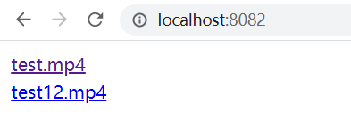

# 软件体系结构课程项目开发


## 视频展示

https://www.bilibili.com/video/BV1Dv411p7CX （因为中间有一次播放视频音量没控制好，所以会有音量突然很高的一下，当视频中提示降低音量的时候请立即降低音量）


## 功能实现

#### 基本配置

* 使用 `MinIO` 存储上传和编码之后的视频，运行 `MinIO` 的指令如下，运行之后通过 `http://localhost:9293/` 访问到管理界面，上传视频之后在管理界面可以看到三个 Bucket ：`video`, `720p` 和 `360p`，分别用于存储原视频和编码之后的视频。

  ```
  docker-compose  -f docker_minio.yml -p minio  up -d --build
  ```

* 消息队列使用的是 `rabbitmq`，运行的指令如下，运行之后通过 `http://localhost:15672` 访问。

  ```
  docker run -d -p 5672:5672 -p 15672:15672 --name my-rabbit rabbitmq:3-management
  ```

* 使用 `ffmpeg` 对视频进行编码，运行的时候需要将 `ffmpeg.exe` 放在文件夹 `ffmpeg\bin` 中，因为它有两百多 MB，所以就没放在github 上，可以通过该链接下载：https://box.nju.edu.cn/f/4b587e4f0b964ef2a089/?dl=1


#### 上传视频

* 在 `uploadvideo` 项目中实现，在该项目中运行 `mvn spring-boot:run` 之后可以通过 `localhost:8080` 访问，访问到的页面如下：

  

* 点击 `选择文件` 按钮选择需要上传的视频，然后点击 `上传` 按钮完成视频的上传，视频上传成功之后会返回视频的文件名。

  

* 内部逻辑为，在 controller 中连接 `MinIO`，并创建三个 Bucket，之后把获得的视频放入 Bucket `video`中，并把视频文件的文件名和类型通过 `rabbitmq` 传递给 `encodevide` 进行编码。


#### 视频编码

* 在 `encodevideo` 项目中实现，通过 `mvn spring-boot:run` 指令运行，运行在 8081 端口，但是因为没有做界面，所以访问不到。
* 内部逻辑为，先从消息队列 `rabbitmq` 中读取 `uploadvideo` 发送过来的视频信息，然后根据视频信息从 MinIO 中下载视频，保存为临时文件，然后使用 `ffmpeg` 对视频进行编码，分别编码为 720p 和 360p，同样保存为临时文件，然后将这些文件上传到 MinIO 中对应的 Bucket中，最后将所有的临时文件删除。


#### 下载视频

* 在 `downloadvideo` 项目中实现，通过 `mvn spring-boot:run` 指令运行，然后通过 `localhost:8082` 访问，访问到的界面如下，其中展示了上传之后的所有视频名

  

* 点击视频之后跳转到播放页面，在播放页面可以通过最上面的六个按钮选择不同的清晰度或者下载该视频的不同清晰度版本

  

* 内部逻辑为，读取 `MinIO` 原视频所在的 Bucket: `video`，获得所有的文件名之后展示在首页，然后点击视频之后跳转到播放页，在播放页中根据不同清晰度从 `MinIO` 对应 Bucket 中读取对应视频，然后进行播放或者下载。


## 非功能性要求实现

#### 负载均衡

* 通过 haproxy 对上传和下载系统进行扩展，对应脚本在文件夹 `test&results\haproxy` 中

* 先把上传系统通过 docker 运行在 8083、8084、8085、8086端口上，然后运行 `haproxy -f upload.cfg` 对上传系统进行扩展

* 把下载系统通过 docker 运行在 8087、8088、8089、8090 端口上，然后运行 `haproxy -f download.cfg` 对下载系统进行扩展

  

#### 编码等待

* 在 `encodevideo` 系统中，在从消息队列中读取视频信息的时候，不是直接对视频进行编码，而是把这些信息存储在一个队列中，如果当前执行编码的线程数小于3，则新启动一个线程对新来的文件进行编码，否则不做处理。直到有视频编码结束，才从队列中再拿出一个视频进行处理。


## 压力测试

#### 上传系统

* 使用 gatling 进行测试，测试脚本为 `test&results\gatling\UploadTest.scala`

* 在测试过程中，我分别对两个和四个节点（每个节点的cpu数目为1）进行了测试，每种配置测试三次

* 测试的内容为：模拟20个用户同时对一个 13 MB 的视频进行上传

* 详细报告放在 `test&results\upload` 中，测试结果中的 ` mean response time ` 如下: 

  |        | 2-nodes     | 4-nodes     |
  | ------ | ----------- | ----------- |
  | 第一次 | 36883       | 27470       |
  | 第二次 | 38637       | 27564       |
  | 第三次 | 37557       | 26928       |
  | 平均   | 37692.33 ms | 27320.67 ms |

* 除了上面表格展示的信息之外，2个节点中的第三次测试，有两个用户的请求因为超时失败了

* 我还对1个节点的情况进行了测试，但是因为总是有很多超时失败的请求，所以最终只展示了 2 个节点和 4 个节点的情况。总的来说，通过扩展，确实可以使整个系统的性能提升很多。


#### 下载系统

* 使用 gatling 进行测试，测试脚本为 `test&results\gatling\DownloadTest.scala`

* 在测试过程中，我分别对两个和四个节点（每个节点的cpu数目为1）进行了测试，每种配置测试三次

* 测试的内容为：模拟20个用户同时对一个 13 MB 的视频进行下载

* 详细报告放在 `test&results\download` 中，测试结果中的 ` mean response time ` 如下: 

  |        | 2-nodes  | 4-nodes  |
  | ------ | -------- | -------- |
  | 第一次 | 20533    | 22269    |
  | 第二次 | 21177    | 21163    |
  | 第三次 | 21293    | 21418    |
  | 平均   | 21001 ms | 21616 ms |

* 在扩展之后，下载系统的性能并没有提升，甚至稍微有点下降，我推测原因是因为这么多个下载系统，其实都是从同一个地方请求的文件，所以最终系统的性能不是由下载系统有几个节点来决定的，而是由 `MinIO` 的下载速度来决定的。